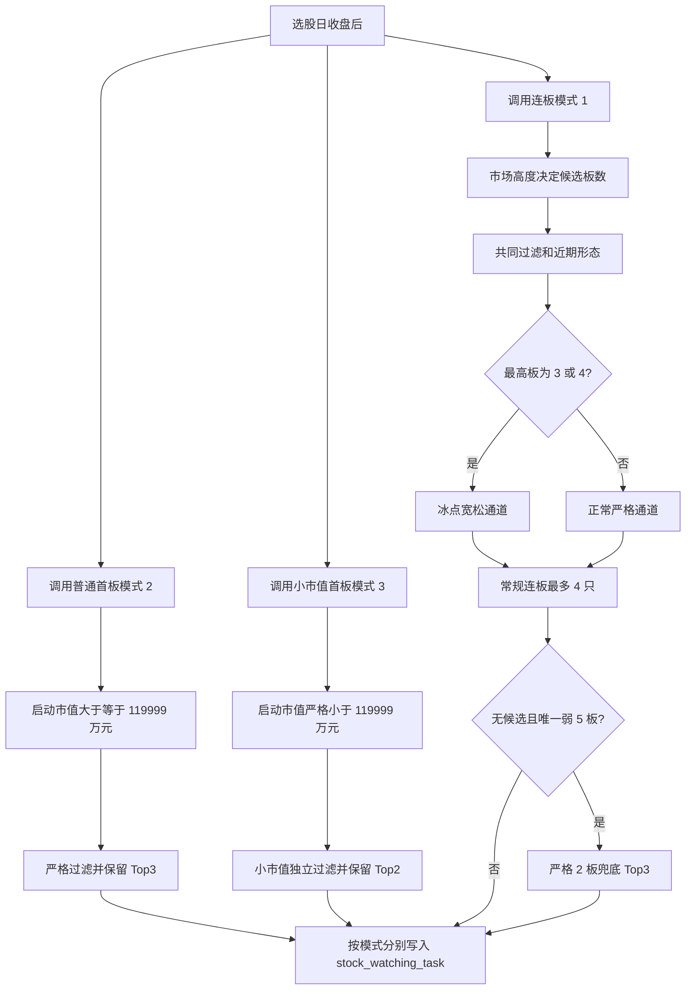

# CompoundWonder 收盘后选股逻辑说明

> 状态：业务口径已确认  
> 整理日期：2026-07-19
> 整理依据：当前工作区实际源码，不以历史讨论或旧注释代替代码行为  
> 主入口：`StockWatchingTaskServiceImpl.createPostCloseWatchingTasks(LocalDate)`

> 2026-07-22 更新：本文中普通首板和小市值首板部分仍按原口径使用；连板接力的旧“严格/冰点”章节已经被三级强度和分触发 V1 替代。连板规则必须以 [`relay-selection-mode-v1.md`](relay-selection-mode-v1.md) 和当前 `relay/selection` 源码为准，不再使用本文第 7、8 节及其旧 Top4/冰点描述。

## 1. 文档范围

本文说明收盘后推荐盯盘任务的完整生成过程，包括：

- 连板接力（`tradeMode = 1`）；
- 普通首板（`tradeMode = 2`）；
- 小市值首板（`tradeMode = 3`）；
- 市场最高板为 3 板或 4 板时的冰点宽松通道；
- 唯一弱 5 板时的严格 2 板兜底；
- 历史筹码过滤、近期形态、评分、排序、数量截断和任务日期。

本文不包含盘中买卖规则、订单簿回放和持仓执行逻辑。

主要源码：

- `StockWatchingTaskServiceImpl`：只负责依次调用三个独立模式；
- `cw-core-trading-strategy/.../relay/selection`：连板接力过滤、评分、冰点通道和弱 5 板规则；
- `cw-core-trading-strategy/.../firstboard/selection`：普通首板过滤、评分和筹码阶梯；
- `cw-core-trading-strategy/.../smallcapfirstboard/selection`：小市值首板独立过滤和评分；
- `cw-mysql-data/.../selection`：三种模式各自的数据查询、历史指标准备、排序截断和落库适配。

## 2. 总体流程

入口不再承载任何选股业务，只按顺序调用连板、普通首板和小市值首板三个服务。三个服务分别查询候选和可转债正股、构建自己的辅助对象，再调用 `cw-core-trading-strategy` 中对应模式的核心选股策略。核心策略返回通过状态、过滤层级、明细和分数；数据模块只负责日志、排序截断和落库。三个模式只复用稳定的 `TradeMode` 编号协议，不复用选股候选或规则实现。

## 3. 日期、单位和核心字段口径

### 3.1 日期

- `recommendDate`：执行收盘后选股的日期，也是涨停日 K 的交易日期。
- `tradeDate`：`recommendDate` 之后的下一个交易日，用于实际盯盘。
- 下一交易日最多向后搜索 15 个自然日；极端情况下仍未找到交易日时，代码退回 `recommendDate + 1`。
- 同一推荐日期、同一交易模式重新运行时，先删除旧任务，再批量写入新任务。

### 3.2 金额与市值

- 流通市值单位：万元；`100_000` 表示 10 亿元。
- 成交额单位：万元。
- 历史最大成交量单位：股。
- 筹码金额公式：`历史最大成交量 × 当日收盘价 ÷ 10_000`，结果单位为万元。

### 3.3 启动指标

- `startMarketCap`：本轮首板前一交易日收盘时的流通市值。
- `startPrice`：本轮首板前一交易日收盘价。
- 日 K 按日期倒序查询，首板取下标 1、2 板取下标 2、3 板取下标 3。
- `currentPrice`：选股当日收盘价。
- `currentTurnoverRate`、`currentTurnover`、`currentAmplitude`：均取选股当日日 K。

### 3.4 历史窗口

- 普通异常状态计数：选股日向前 18 个自然月，包含选股日，再减去本次连板天数。
- 本轮前 20 日异常计数：先跳过本次连续涨停的 1/2/3 根 K 线，再取之前 20 个交易日。
- 筹码窗口：本轮首板前一交易日及之前最近 200 根有效日 K。
- 新股最早 10 根日 K 不参与筹码窗口；数据库不足 11 根历史日 K 时，普通筹码指标为空。
- 90 日历史指标：筹码窗口中 `[本轮首板前一交易日 - 90个自然日, 本轮首板前一交易日]` 范围内的最高板和最大换手率；两项使用完全相同的窗口。

### 3.5 形态指标

- 非正常 K 线：`klineState != 0`。
- 加速缩量板：本轮首板满足 `klineState == 3` 或当日振幅 `<3%` 即命中，不使用换手率条件；本轮第 2/3 板满足 `klineState == 3`、当日振幅 `<3%`、当日换手率 `<15%` 任意一项即命中。辅助对象只记录是否至少命中两根。
- 首板选股振幅：包含当日在内的 3 个交易日。
- 连板选股振幅：包含当日在内的 5 个交易日。
- 振幅公式：`(当日复权收盘价 - 窗口最低复权价) / 窗口最低复权价 × 100%`。
- 10 日涨跌幅：当日复权收盘价相对 10 个交易日前复权收盘价的涨跌幅。
- 历史不足时，3/5 日振幅和 10 日涨跌幅目前返回 `0`。

## 4. 所有候选共同的前置规则

### 4.1 ST

- 初始候选查询排除明确标记为 ST 的股票。
- `isSt == null` 按非 ST 处理。

### 4.2 可转债

- 按选股日期查询当日有效可转债对应的正股。
- 首板和连板全部排除这些正股。

### 4.3 主板范围

业务确认不增加股票代码前缀或上市板块过滤。首板、连板都使用当日涨跌幅 `<11%`，并结合 `consecutiveLimitUpDays` 作为当前主板候选口径。

## 5. 普通首板（tradeMode = 2）

### 5.1 初始候选池

当日日 K 同时满足：

| 条件 | 实际边界 |
|---|---:|
| ST | `isSt == false` 或 `null` |
| 当日流通市值 | `< 22亿元` |
| 当日收盘价 | `< 40元` |
| 当日涨跌幅 | `< 11%` |
| 连板数 | `== 1` |
| 可转债 | 当日不存在有效可转债 |
| 模式强归属 | 启动流通市值 `>= 119_999万元` |

代码没有额外查询 `klineState`，也没有设置涨跌幅下限；涨停身份主要依赖 `consecutiveLimitUpDays == 1`。

### 5.2 普通首板严格过滤顺序

| 顺序 | 过滤层 | 通过条件 |
|---:|---|---|
| 1 | 本轮前 20 日异常 | 非正常 K 线 `< 4次` |
| 2 | 18 个月异常 | 非正常 K 线 `<= 20次` |
| 3 | 摘帽低换手 | 不满足“历史最大换手 `<=25%` 且非 ST 月份 `<18` 且非 ST 月份 `<` 上市月份” |
| 4 | 3 日振幅 | `< 20%` |
| 5 | 10 日涨跌幅 | `> -2%` 且 `< 25%` |
| 6 | 启动价格 | `> 3元` |
| 7 | 综合评分 | `> 30分` |
| 8 | 普通筹码过滤 | 通过第 9 章完整筹码规则 |

启动流通市值小于 `119_999万元` 的股票归小市值首板独占，即使未通过小市值规则，也不能回退普通首板。满足普通首板全部条件后构建 `tradeMode = 2` 的任务。

### 5.3 普通首板数量

普通首板先按以下顺序排序：

1. 综合评分降序；
2. 分数相同，选股当日收盘价升序；
3. 分数和价格相同，股票代码升序。

排序后只保留前 3 只。

## 6. 小市值首板（tradeMode = 3）

小市值首板已经从普通首板补充分支拆成独立交易模式。它自行查询候选、自行构建辅助对象、自行过滤和保留 Top2，并按 `tradeMode = 3` 单独落库。

### 6.1 必须满足

| 条件 | 实际边界 |
|---|---:|
| 连板数 | `== 1` |
| 可转债 | 无 |
| 启动流通市值 | `< 119_999万元`，约 11.9999亿元 |
| 首板涨停价格 | `>= 4.5元`，使用选股日涨停收盘价 |
| 最近 200 根 K 线历史最大换手率 | `<= 30%` |
| 最近 200 根 K 线历史最高板 | `< 3板` |
| 本轮前 20 日异常状态次数 | `< 4次` |
| 18 个月异常状态次数 | `<= 25次` |
| 3 日振幅 | `< 20%` |
| 10 日涨跌幅 | `> -2%` 且 `< 25%` |

它仍然受首板初始候选池约束，因此当日流通市值仍需 `<30亿元`、当日收盘价 `>=4.5元且<40元`、当日涨跌幅 `<11%`。

普通首板与小市值首板使用启动市值强归属：`<119_999万元` 只走小市值模式，`>=119_999万元` 只走普通首板。两边过滤失败后都不能跨模式回退。

### 6.2 明确放宽

小市值首板不再执行：

- 普通首板的历史换手与摘帽月份组合过滤，但仍独立要求 200 根 K 线历史最大换手率 `<=30%`；
- 启动价格 `>3元`；
- 综合评分 `>30`；
- 普通筹码市值/换手/价格阶梯；

该分支的任务分数只使用“启动市值评分”，不使用完整综合评分。

### 6.3 数量

满足条件的小市值候选在自己的模式内排序，最多保留 2 只。普通首板 Top3 与小市值首板 Top2 是两套独立结果，不再合并为同一首板模式列表。

当历史筹码数据不足时，`200根K线历史最高板` 和历史最大换手率的空值按 `0` 处理。业务确认新股不考虑这种历史不足情况，当前不增加额外拒绝逻辑。

## 7. 连板接力

### 7.1 初始候选池

| 条件 | 实际边界 |
|---|---:|
| ST | `isSt == false` 或 `null` |
| 当日涨跌幅 | `< 11%` |
| 当日流通市值 | `< 50亿元` |
| 当日收盘价 | `< 45元` |
| 连板数 | 2 板或 3 板 |
| 可转债 | 当日不存在有效可转债 |

连板流程还要求情绪周期表至少存在截至选股日最近 3 条记录，否则当天不生成连板任务。

### 7.2 市场高度决定候选板数

`today`、`yesterday`、`dayBeforeYesterday` 分别表示今天、昨天、前天的市场最高板。

| 市场状态 | 允许候选 |
|---|---|
| `today <= 4` | 2 板、3 板 |
| `today > 4` 且 `yesterday <= dayBeforeYesterday`，同时前天最高板 `<7` | 只选 3 板 |
| 上一条中前天最高板 `>=7`，但前天最高板股票等于前天周期占领股 | 只选 3 板 |
| `today > 4`、`yesterday > dayBeforeYesterday` 且 `today <= yesterday`，同时昨天最高板 `<7` | 2 板、3 板 |
| 上一条中昨天最高板 `>=7`，但昨天最高板股票等于昨天周期占领股 | 2 板、3 板 |
| 高度持续晋级且不满足上述退潮/龙头条件 | 不生成常规连板候选 |

非冰点候选还会把当日收盘价进一步限制为 `<40元`。当日最高板为 3 或 4 时，冰点候选保留初始查询的 `<45元` 上限。

### 7.3 连板共同过滤

严格通道和冰点通道都先执行：

| 顺序 | 条件 |
|---:|---|
| 1 | 本轮前 20 个交易日非正常 K 线 `<4次` |
| 2 | 本轮不存在至少两根加速缩量板；2 板检查两根，3 板检查三根 |
| 3 | 本轮前 90 个自然日历史最大换手率 `<=35%` |
| 4 | 不满足“历史最大换手 `<=25%` 且非 ST 月份 `<18` 且非 ST 月份 `<` 上市月份” |
| 5 | 通过连板近期形态过滤 |

连板没有“18 个月异常状态最多 20/25 次”的硬过滤。该指标在正常严格通道中通过评分扣分发挥作用；冰点通道没有最低分，因此只影响最终排序。

### 7.4 连板近期形态

该层在严格通道和冰点通道分流前统一执行。

| 候选 | 5 日振幅 | 10 日涨跌幅 |
|---|---:|---:|
| 2 板 | `<34%` | `>11.5%` 且 `<35%` |
| 3 板 | `<=48%` | `<50%`，无下限 |

## 8. 连板的三条后续通道

### 8.1 正常严格通道

不属于冰点 3/4 板时继续执行：

1. 若启动价格 `<=3元` 且启动流通市值 `<25亿元`，过滤；启动市值 `>=25亿元` 时不因该低价条件直接过滤。
2. 综合评分必须 `>=15分`。
3. 通过第 9 章完整筹码过滤。

常规连板最终最多保留 4 只。

### 8.2 冰点 3/4 板宽松通道

当日市场最高板等于 3 或 4 时，所有 2 板、3 板候选都进入冰点通道。

冰点通道仍然先经过共同过滤和近期形态，然后执行以下硬条件：

| 条件 | 边界 |
|---|---:|
| 最近 200 根 K 线历史最大换手 | `<=55%` |
| 最近 200 根 K 线历史最高板 | `<=5板` |
| 本轮前 90 个自然日历史最高板 | `<3板` |
| 本轮前 90 个自然日历史最大换手率 | `<=35%` |
| 启动流通市值 | `<44亿元` |
| 当日收盘价 | `<45元` |
| 最大成交量日换手率 | `<50%` |
| 当日振幅 | `<15%` |

按启动流通市值继续分档：

- `<13亿元`：满足上述条件即可，不限制当日换手率、当日成交额和最大成交量日成交额。
- `13亿元至<44亿元`：还要求当日换手率 `<50%`、当日成交额 `<25亿元`、最大成交量日成交额 `<30亿元`。

冰点通道绕过：

- 正常启动价格过滤；
- 最低综合评分；
- 普通筹码市值/换手/价格阶梯；
- 低换手低筹码金额特殊通道。

入选任务仍计算并保存综合评分。冰点候选和普通候选合并后，常规连板整体最多保留 4 只。

### 8.3 唯一弱 5 板严格 2 板兜底

只有同时满足以下前提才评估：

1. 常规连板流程在内存中一只候选都没有；
2. 当日市场最高板为 5 板；
3. 当天过滤 ST 后恰好只有一只 5 板股票；
4. 这只 5 板的质量指标完整。

唯一 5 板出现以下任一情况时，启动兜底：

| 风险项 | 触发条件 |
|---|---:|
| 当日流通市值过大 | `>45亿元` |
| 当日换手率过高 | `>45%` |
| 当日振幅过小 | `<2.5%` |
| 当日振幅过大 | `>13%` |
| 启动价格过低 | `<2.5元` |
| 启动价格过高 | `>30元` |

边界值 45 亿元、45%、2.5%、13%、2.5 元和 30 元本身不触发兜底。

兜底启动后：

- 只重新选择 2 板，不选 3 板；
- 当日收盘价必须 `<40元`；
- 禁止使用冰点宽松通道；
- 完整执行连板共同过滤、近期形态、启动价格、最低评分和普通筹码过滤；
- 最多保留 3 只。

## 9. 普通筹码过滤

普通首板、正常严格连板和弱 5 板兜底使用完整筹码过滤。冰点通道只使用其中的历史硬限制；所有连板通道还在分流前独立限制同一 90 日窗口的历史最大换手率 `<=35%`。小市值首板不使用完整筹码过滤，但独立限制最近 200 根 K 线历史最大换手率 `<=30%`。

### 9.1 历史硬限制

| 指标 | 通过条件 |
|---|---:|
| 历史最大换手率 | `<=55%` |
| 最近 200 根 K 线历史最高板 | `<=5板` |
| 本轮前 90 个自然日历史最高板 | `<3板` |

缺少上述历史指标时直接拒绝。

近 90 个自然日历史最大换手率 `<=35%` 是连板专属共同规则，不属于首板的公共历史硬限制。该规则在严格、冰点和弱 5 板兜底分流前执行，超过 35% 或指标缺失时直接拒绝。

### 9.2 启动市值—历史最大换手—当日价格阶梯

每只股票只进入一个对应市值档，不会从高市值档回退到低市值档。

| 启动流通市值 | 历史最大换手率 | 当日收盘价 |
|---:|---:|---:|
| `<=9.3亿` | `<55%` | 不限 |
| `<=10.6亿` | `<50%` | 不限 |
| `<=12亿` | `<46%` | 不限 |
| `<=13.88亿` | `<44%` | 不限 |
| `<=15.1亿` | `<43%` 且 `<25元`，或 `<50%` 且 `<20元` | 见左列组合 |
| `<=16.8亿` | `<39%` | `<22元` |
| `<=18.7亿` | `<35%` | `<20元` |
| `<=20亿` | `<30%` | `<20元` |
| `<=20.8亿` | `<27%` | `<18.5元` |
| `<=22亿` | `<25%` | `<17元` |
| `<=25亿` | `<25%` | `<16元` |
| `>25亿` | 普通阶梯不通过 | — |

### 9.3 低换手、低筹码金额特殊通道

普通阶梯未通过时，如果同时满足以下条件仍可通过：

- 历史最大换手率 `<20%`；
- 当日收盘价 `<17.5元`；
- `历史最大成交量 × 当日收盘价 ÷ 10_000 < 75_800万元`。

该特殊通道仍受首板当日流通市值 `<30亿元`、连板当日流通市值 `<50亿元` 的初始候选查询限制，也不能绕过历史硬限制。

## 10. 综合评分

综合评分公式：

`启动市值分 + 历史最大换手分 + 启动价格分 + 地域分 + 当日换手分 + 连板分 - 异常状态扣分`

最终最低为 0 分。

### 10.1 启动市值分

| 启动流通市值 | 分数 |
|---:|---:|
| `<=8.1亿` | 30 |
| `8.1亿至9.5亿` | 30 线性降至 20 |
| `9.5亿至15亿` | 20 线性降至 10 |
| `15亿至20亿` | 10 线性降至 0 |
| `>20亿` 或空值 | 0 |

### 10.2 历史最大换手分

| 历史最大换手率 | 分数 |
|---:|---:|
| `<=15%` | 25 |
| `15%至25%` | 25 线性降至 20 |
| `25%至37.5%` | 20 线性降至 15 |
| `37.5%至55%` | 15 线性降至 0 |
| `>55%` 或空值 | 0 |

### 10.3 启动价格分（按实际代码）

| 启动价格 | 分数 |
|---:|---:|
| `<3.3元` 或 `>19.5元` 或空值 | 0 |
| `3.3元至4元` | 10 |
| `>4元至10元` | 15 |
| `10元至12.5元` | 15 线性降至 10 |
| `12.5元至15.5元` | 10 线性降至 7 |
| `15.5元至19.5元` | 7 线性降至 0 |

这里在 4 元边界存在从 10 分跳到 15 分的离散变化。

### 10.4 地域分

按地域名称前两个字符匹配：

| 地域 | 分数 |
|---|---:|
| 江苏、浙江、广东、上海、深圳 | 10 |
| 山东、湖南、湖北、安徽 | 7 |
| 吉林、辽宁、黑龙江、四川 | 3 |
| 其他或空值 | 0 |

### 10.5 当日换手分

| 当日换手率 | 分数 |
|---:|---:|
| `<=17%` | 10 |
| `>17%且<=30%` | 7 |
| `30%至55%` | 7 线性降至 2 |
| `>55%` 或空值 | 0 |

### 10.6 连板分

| 连板数 | 分数 |
|---:|---:|
| 首板 | 0 |
| 2 板 | 5 |
| 3 板 | 15 |

### 10.7 异常状态扣分

1. 把启动流通市值从万元换算为亿元并四舍五入。
2. 免扣次数：`max(0, 27 - 四舍五入后的启动市值亿元数)`。
3. 扣分：`max(0, 18个月异常状态次数 - 免扣次数)`。
4. 每超出 1 次扣 1 分。

周期占领股不额外加分，连板任务统一使用上述综合评分。

## 11. 最终排序、数量和入库

### 11.1 排序

所有进入最终列表的任务统一使用：

1. `limitUpScore` 降序；
2. 同分时当日收盘价升序；
3. 分数、价格相同时股票代码升序。

### 11.2 数量

| 模式 | 数量 |
|---|---:|
| 普通严格首板 | Top3 |
| 小市值首板（mode 3） | Top2 |
| 常规连板（包含冰点） | Top4 |
| 唯一弱 5 板严格 2 板兜底 | Top3 |

### 11.3 入库

三个交易模式分别按 `recommendDate + tradeMode` 删除旧任务，再保存新任务。mode 1、2、3 互不覆盖。任务保存：股票代码、名称、分数、连板数、推荐日期、下一交易日、交易模式和创建时间。

## 12. 日志可观测性

当前过滤流程会记录：

- 选股模式；
- 推荐日期；
- 股票代码和名称；
- 被过滤的具体层级；
- 实际指标和要求边界；
- 因 TopN 数量上限被截断时的排名和分数；
- 冰点通道及弱 5 板兜底的触发层级。

因此可以通过日志还原一只股票在哪一层被淘汰。

## 13. 已确认事项

- 主板候选不增加代码前缀过滤，以涨幅 `<11%` 和 `consecutiveLimitUpDays` 为准；
- 小市值首板是独立 `tradeMode = 3`，最多保留 2 只；
- 小市值首板的选股日首板涨停收盘价必须 `>=4.5元`，低于 4.5 元直接过滤；
- 普通首板与小市值首板以启动流通市值 `119_999万元` 强归属，任何失败候选不得跨模式回退；
- 小市值首板同时执行前 20 日异常 `<4次` 和 18 个月异常 `<=25次`，任意一条失败都过滤；
- 新股历史指标不足的情况不额外处理；
- 涨停候选只使用 `consecutiveLimitUpDays`，不增加 `klineState` 条件；
- 3/5 日振幅和 10 日涨跌幅历史不足时继续使用当前默认值；
- 正常连板低价过滤维持组合条件：启动价格 `<=3元` 且启动流通市值 `<25亿元`；
- 启动价格评分维持 4 元边界跳变：`<=4元` 得 10 分，刚超过 4 元后得 15 分；
- 周期占领股不额外加 10 分，相关遗留方法已经删除；
- 注释、日志和旧测试与代码冲突时，以当前生产代码为准，相关文字和测试边界已经同步。

本文是当前稳定选股逻辑的完整说明，可作为后续选股、回测和前端展示任务的统一依据。
